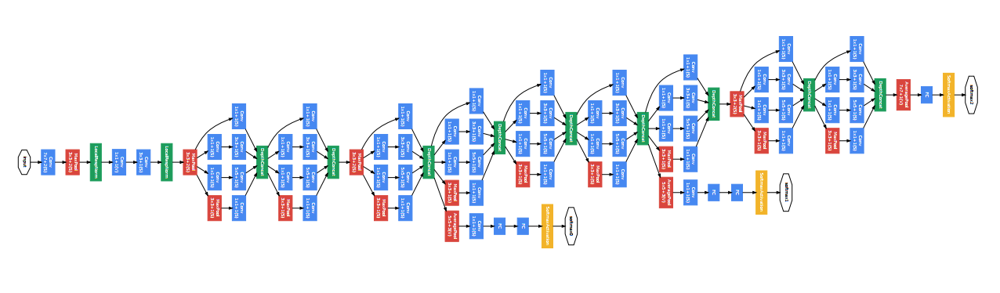

# Chart Classification based on GoogleNet

-Chart Image Classification based on GoogleNet, with ChartSense Datasets.
- Architecture of GoogLeNet from the paper:

## Requirements
- Python 3.3+
- [TensorFlow 1.9+](https://www.tensorflow.org/)
- [Numpy](http://www.numpy.org/)
- [Scipy](https://www.scipy.org/)

## Usage

- Train

python3 inception_cifar.py --train --lr 0.01 --bsize 50 --keep_prob 0.2 --maxepoch 100

- Evaluate

python3 inception_cifar.py --eval --lr 0.01 --bsize 50 --keep_prob 0.2 --maxepoch 100

